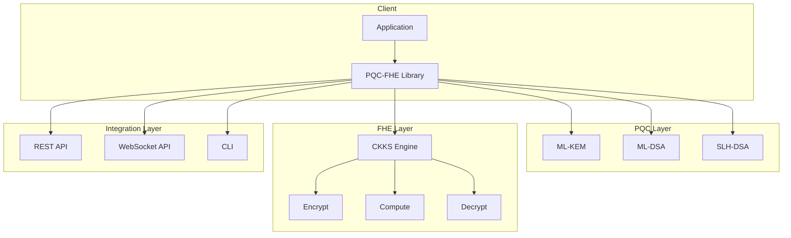

# PQC-FHE Integration Portfolio

<div align="center">
  <h3>Post-Quantum Cryptography + Fully Homomorphic Encryption</h3>
  <p>A comprehensive library for quantum-resistant security with privacy-preserving computation</p>
</div>

---

## Overview

**PQC-FHE Integration** is a production-ready library that combines two cutting-edge cryptographic technologies:

- **Post-Quantum Cryptography (PQC)**: NIST FIPS 203/204/205 compliant algorithms (ML-KEM, ML-DSA, SLH-DSA) that resist attacks from quantum computers
- **Fully Homomorphic Encryption (FHE)**: CKKS scheme implementation enabling computation on encrypted data

## Key Features

<div class="grid cards" markdown>

-   :material-shield-lock:{ .lg .middle } **Quantum-Resistant Security**

    ---

    Implements NIST standardized post-quantum algorithms including ML-KEM-768 (CRYSTALS-Kyber) and ML-DSA-65 (CRYSTALS-Dilithium)

    [:octicons-arrow-right-24: PQC Reference](api/pqc_key_manager.md)

-   :material-lock-pattern:{ .lg .middle } **Privacy-Preserving Computation**

    ---

    CKKS homomorphic encryption enables arithmetic operations on encrypted data without decryption

    [:octicons-arrow-right-24: FHE Reference](api/fhe_engine.md)

-   :material-api:{ .lg .middle } **Multiple Integration Options**

    ---

    REST API, WebSocket API, CLI, and Python library interfaces for flexible integration

    [:octicons-arrow-right-24: API Overview](api/overview.md)

-   :material-kubernetes:{ .lg .middle } **Production Ready**

    ---

    Kubernetes Helm charts, Docker support, monitoring, and comprehensive security hardening

    [:octicons-arrow-right-24: Deployment Guide](guides/configuration.md)

</div>

## Quick Start

### Installation

```bash
pip install pqc-fhe-integration
```

### Basic Usage

```python
from pqc_fhe_integration import PQCKeyManager, FHEEngine

# Post-Quantum Key Exchange
pqc = PQCKeyManager()
public_key, secret_key = pqc.generate_kem_keypair("ML-KEM-768")
ciphertext, shared_secret = pqc.encapsulate(public_key)

# Homomorphic Encryption
fhe = FHEEngine()
encrypted = fhe.encrypt([1.5, 2.5, 3.5])
result = fhe.add(encrypted, encrypted)
decrypted = fhe.decrypt(result)  # [3.0, 5.0, 7.0]
```

## Supported Algorithms

### Post-Quantum Key Encapsulation (FIPS 203)

| Algorithm | Security Level | Public Key | Ciphertext | Use Case |
|-----------|---------------|------------|------------|----------|
| ML-KEM-512 | Level 1 | 800 bytes | 768 bytes | IoT devices |
| **ML-KEM-768** | **Level 3** | **1184 bytes** | **1088 bytes** | **Recommended** |
| ML-KEM-1024 | Level 5 | 1568 bytes | 1568 bytes | High security |

### Post-Quantum Digital Signatures (FIPS 204/205)

| Algorithm | Security Level | Signature Size | Use Case |
|-----------|---------------|----------------|----------|
| ML-DSA-44 | Level 2 | 2420 bytes | Standard apps |
| **ML-DSA-65** | **Level 3** | **3293 bytes** | **Recommended** |
| ML-DSA-87 | Level 5 | 4595 bytes | High security |
| SLH-DSA-SHA2-* | Level 1-5 | Variable | Hash-based backup |

### Fully Homomorphic Encryption

| Scheme | Operations | Precision | Use Case |
|--------|------------|-----------|----------|
| CKKS | +, -, ×, scalar ops | ~40 bits | Financial, ML |

## Architecture



## Use Cases

### Financial Services

- Secure key exchange for inter-bank communication
- Privacy-preserving fraud detection
- Encrypted portfolio analytics

### Healthcare

- Secure sharing of patient data
- Privacy-preserving clinical research
- Encrypted medical imaging analysis

### Enterprise

- Quantum-resistant document signing
- Secure multi-party computation
- Encrypted database queries

## Performance

Benchmarks on Intel Xeon (3.0 GHz):

| Operation | Time | Throughput |
|-----------|------|------------|
| ML-KEM-768 KeyGen | 0.12 ms | 8,333/s |
| ML-KEM-768 Encapsulate | 0.15 ms | 6,667/s |
| ML-DSA-65 Sign | 0.45 ms | 2,222/s |
| FHE Encrypt (1024 slots) | 2.3 ms | 435/s |
| FHE Add | 0.1 ms | 10,000/s |
| FHE Multiply | 4.5 ms | 222/s |

## Security Considerations

!!! warning "Production Deployment"
    - Always use TLS 1.3 for transport security
    - Implement proper key rotation policies
    - Follow the [Security Best Practices](security/best_practices.md)

## License

This project is licensed under the MIT License. See [LICENSE](https://github.com/your-username/pqc-fhe-portfolio/blob/main/LICENSE) for details.

## References

- [NIST FIPS 203: ML-KEM](https://csrc.nist.gov/pubs/fips/203/final)
- [NIST FIPS 204: ML-DSA](https://csrc.nist.gov/pubs/fips/204/final)
- [NIST FIPS 205: SLH-DSA](https://csrc.nist.gov/pubs/fips/205/final)
- [CKKS Scheme](https://eprint.iacr.org/2016/421)
