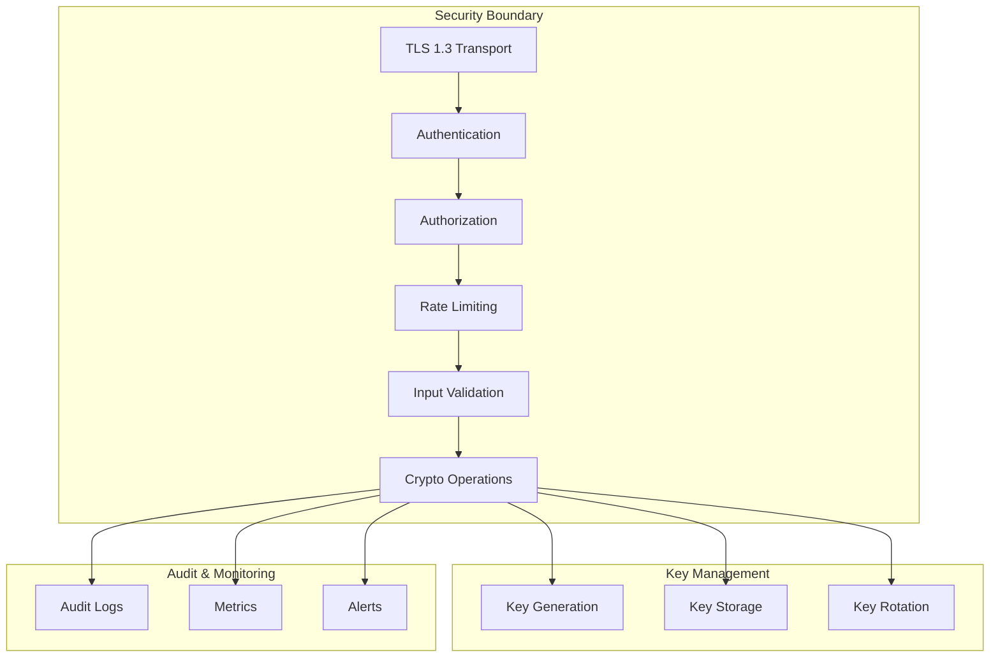

# Security Overview

This document provides an overview of the security architecture and considerations for the PQC-FHE Integration library.

## Threat Model

### Assets Protected

1. **Cryptographic Keys**
   - PQC key pairs (KEM and signatures)
   - FHE secret keys and contexts
   - Derived shared secrets

2. **Encrypted Data**
   - FHE ciphertexts
   - KEM ciphertexts
   - Signed messages

3. **System Integrity**
   - API authentication
   - Configuration integrity
   - Audit logs

### Threat Categories

#### Quantum Computing Threats

| Threat | Mitigation |
|--------|------------|
| Shor's Algorithm (RSA/ECC) | ML-KEM, ML-DSA (lattice-based) |
| Grover's Algorithm | 256-bit keys for ML-KEM-1024 |
| Harvest Now, Decrypt Later | Quantum-resistant from day one |

#### Classical Threats

| Threat | Mitigation |
|--------|------------|
| Key Extraction | Hardware isolation, secure memory |
| Man-in-the-Middle | TLS 1.3, certificate pinning |
| Replay Attacks | Nonces, timestamps, session tokens |
| Side-Channel Attacks | Constant-time implementations |

## Security Architecture

## NIST Compliance

### FIPS 203 (ML-KEM)

- Module-Lattice-Based Key-Encapsulation Mechanism
- Security levels: 1 (512), 3 (768), 5 (1024)
- Based on CRYSTALS-Kyber

### FIPS 204 (ML-DSA)

- Module-Lattice-Based Digital Signature Algorithm
- Security levels: 2 (44), 3 (65), 5 (87)
- Based on CRYSTALS-Dilithium

### FIPS 205 (SLH-DSA)

- Stateless Hash-Based Digital Signature Algorithm
- Security levels: 1-5
- Based on SPHINCS+

## Security Features

### Transport Security

- TLS 1.3 required for all network communication
- Certificate validation with pinning option
- Forward secrecy with ephemeral keys

### Authentication

- API key authentication
- JWT token support
- mTLS for service-to-service

### Authorization

- Role-based access control (RBAC)
- Per-operation permissions
- IP allowlisting

### Key Management

- Secure key generation using CSPRNG
- Encrypted key storage at rest
- Automatic key rotation policies
- Key backup and recovery procedures

### Audit Logging

- All cryptographic operations logged
- Tamper-evident log format
- Configurable retention policies

## Security Hardening Checklist

### Production Deployment

- [ ] Enable TLS 1.3 with strong cipher suites
- [ ] Configure certificate pinning
- [ ] Enable API authentication
- [ ] Set up rate limiting
- [ ] Configure audit logging
- [ ] Enable monitoring and alerting
- [ ] Implement key rotation schedule
- [ ] Set appropriate file permissions
- [ ] Use network segmentation
- [ ] Enable intrusion detection

### Container Security

- [ ] Use minimal base images
- [ ] Run as non-root user
- [ ] Set resource limits
- [ ] Enable read-only filesystem
- [ ] Drop all capabilities
- [ ] Use seccomp profiles
- [ ] Scan images for vulnerabilities

### Kubernetes Security

- [ ] Enable Pod Security Standards
- [ ] Configure Network Policies
- [ ] Use Secrets encryption at rest
- [ ] Enable audit logging
- [ ] Implement RBAC
- [ ] Use service mesh (optional)

## Vulnerability Disclosure

### Reporting Security Issues

Please report security vulnerabilities to: security@your-domain.com

**Do NOT:**
- Open public GitHub issues for security vulnerabilities
- Disclose vulnerabilities publicly before they are fixed

**We will:**
- Acknowledge receipt within 24 hours
- Provide an initial assessment within 72 hours
- Work with you to understand and resolve the issue
- Credit you in the security advisory (if desired)

## Security Updates

Security updates are released as needed. Subscribe to security advisories:

- GitHub Security Advisories
- Mailing list: security-announce@your-domain.com

## Compliance

### Standards Support

- SOC 2 Type II compatible
- GDPR compliant (data encryption at rest)
- HIPAA technical safeguards ready
- PCI DSS encryption requirements

### Certifications

- NIST FIPS 203/204/205 algorithms
- Common Criteria (planned)

## Next Steps

- [Threat Model Details](threat_model.md)
- [Security Best Practices](best_practices.md)
- [Architecture Overview](../development/architecture.md)
